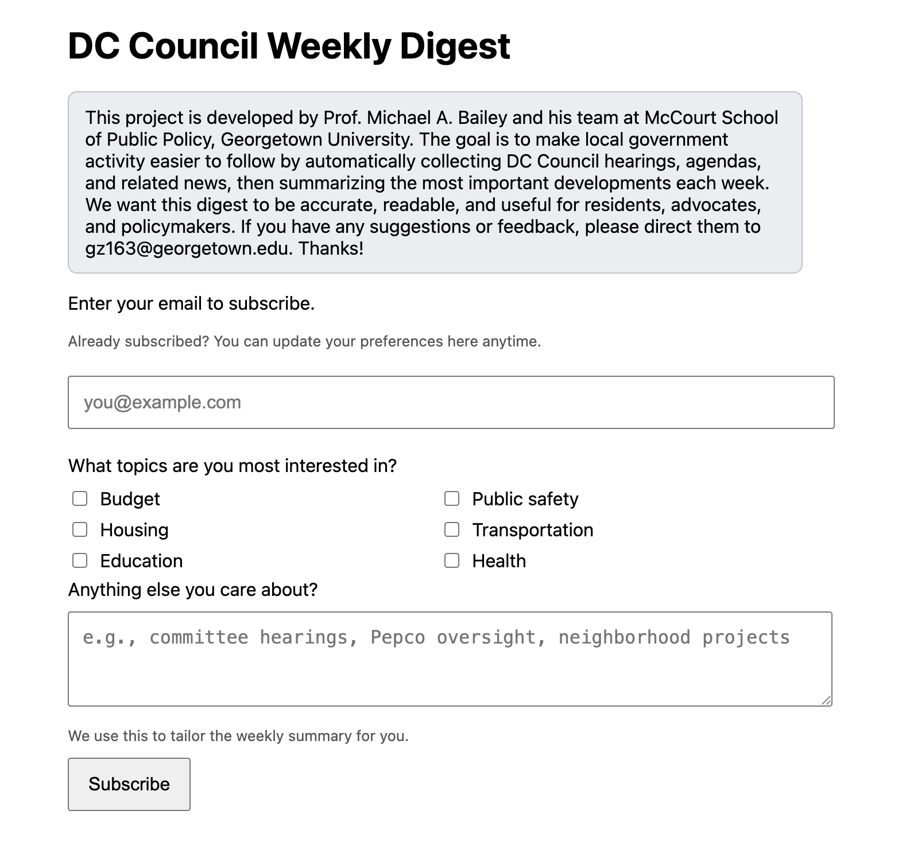

# DC Council Agent

A lightweight pipeline that collects DC Council updates from multiple sources, stores them in SQLite, and sends a weekly email digest to subscribers. The newsletter includes a three-bullet AI summary with clickable sources and supports per-subscriber customization based on selected topics and free-text interests.

Subscribe [here](https://guozhan11.github.io/dc-council-agent/)!



---

## What this repo does

1. **Collectors** gather items from different sources (RSS, YouTube, etc.).
2. **SQLite** stores normalized items (deduped).
3. **Digest sender** pulls the last 7 days of items, ranks them, summarizes via OpenAI into a concise three-bullet brief, renders a clean HTML newsletter, and sends via Gmail SMTP.
4. **Subscriber service** (Google Apps Script) stores subscriber emails, unsubscribe tokens, and interest preferences in a Google Sheet and exposes endpoints used by the Python sender.

---

## Digest behavior

- Time window: only items from the last 7 days are eligible for each weekly run.
- Summary input: all items in that 7-day window are sent to OpenAI.
- Personalization pre-filter:
	- For each subscriber, the sender extracts keyword-like terms from `topics` + `interests`.
	- It first tries to summarize only interest-matching weekly items.
	- If no matching items are found, it falls back to general weekly items and shows a notice:
		- `No updates this week for your interests: ... Showing general updates instead.`
- Source/citation integrity:
	- Bullets are normalized to citation ids.
	- Summaries are blocked only when structure is unusable (for example empty bullets/sources or uncited bullets).
- OpenAI review step:
	- A secondary OpenAI check runs as a format/readability reviewer.
	- Reviewer failures are warning-only (do not block send) unless structural checks fail.

---

---

## Sources

The newsletter is generated from a mix of official and local news sources. Current feeds include:

- DC Council official Granicus hearings feed
- DC Register recent rulemakings (Proposed + Emergency), filtered to DC Council-related notices only
- DC Council YouTube channel feed
- Google Alerts for major news mentions
- States Newsroom (DC Bureau)
- Washington Post (Politics, Local)
- Washington Times (Headlines)
- 51st.news (Latest)
- Popville
- Greater Greater Washington

---

## Required environment variables / GitHub Secrets

The weekly digest job needs these values (locally via `.env`, or in GitHub via **Settings → Secrets and variables → Actions**):

- `SUBSCRIBERS_API_URL`: Your Google Apps Script `/exec` deployment URL (used for `?path=active_subscribers`)
- `SUBSCRIBERS_API_KEY`: Shared key that protects the `active_subscribers` endpoint
- `OPENAI_API_KEY`: Used to generate the 3-bullet AI summary
- `GMAIL_SMTP_USERNAME`: Gmail address used to send the digest
- `GMAIL_SMTP_APP_PASSWORD`: Gmail App Password (requires 2FA enabled)

Optional:

- `TEST_TO_EMAIL`: Test recipient address
- `TEST_ONLY_MODE`: Set to `true`/`1` to send only to `TEST_TO_EMAIL`
- `TEST_SUBSCRIBER_TOPICS`: Optional local-only topics override used when `TEST_TO_EMAIL` is not a real subscriber
- `TEST_SUBSCRIBER_INTERESTS`: Optional local-only interests override used when `TEST_TO_EMAIL` is not a real subscriber
- `PREVIEW_ONLY_MODE`: Set to `true`/`1` to generate previews and skip all sends
- `PREVIEW_OUTPUT_DIR`: Directory for rendered preview files (default `tmp/email_previews`)
- `PREVIEW_RECIPIENT_LIMIT`: Max number of previews to render in preview mode
- `AUTO_QUALITY_CHECK`: Set `false` to disable OpenAI reviewer step
- `QUALITY_CHECK_MODEL`: Model used by the reviewer (default `gpt-4.1-mini`)
- `QUALITY_CHECK_MIN_SCORE`: Reviewer warning threshold (default `70`)
- `DIGEST_ALERT_TO_EMAIL`: Address that receives delivery-failure alerts
- `MAKEUP_TARGET_EMAILS`: Comma-separated emails to send make-up delivery to specific subscribers only

---

## Automated safety and recovery

- Preflight report (every run): logs bullet count, cited bullet count, source count, and quality score per subscriber.
- Delivery failure report: writes `tmp/failed_recipients.json` with failed recipients and error messages.
- Alert email on failed sends: if `DIGEST_ALERT_TO_EMAIL` is set, the sender emails a failure summary automatically.
- Targeted make-up runs: set `MAKEUP_TARGET_EMAILS` to retry only specific subscribers instead of everyone.
- Preview mode for CI/manual runs: enable `PREVIEW_ONLY_MODE=true` to generate HTML/TXT previews without delivery.

---

## Folder structure

```text
.
├── .github/                   # GitHub workflows / configs
├── .env                       # Local environment variables (not committed)
├── .venv/                     # Local virtual environment
├── config.yaml                # Main project configuration
├── db.sqlite                  # Local SQLite database
├── requirements.txt           # Python dependencies
├── docs/                      # GitHub Pages static site (subscribe/unsubscribe pages)
├── src/                       # Main Python source code (digest + utilities)
├── template/                  # Email templates
├── x-api/                     # Experiments / scripts using X API (optional)
└── x-scraper/                 # Scraper experiments (optional)